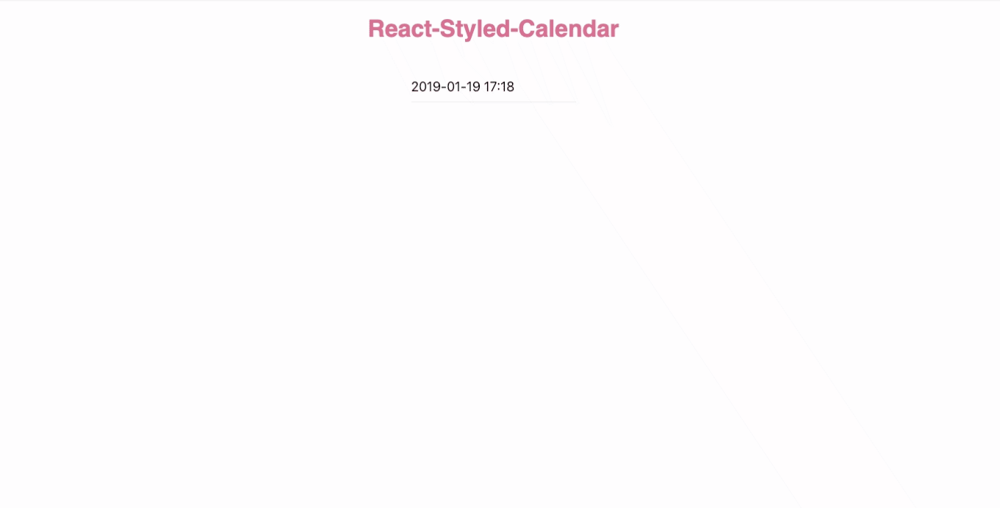
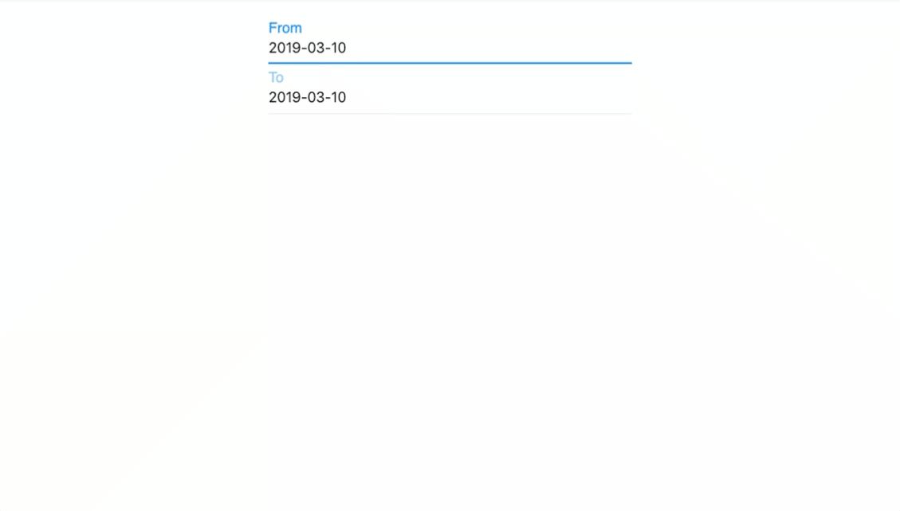

# React-Styled-Calendar


 

A simple React Datepicker component built with [styled-components](https://www.styled-components.com/) and [date-fns](https://date-fns.org/)


## DEMO
DatePicker


RangePicker


[Play with them on Storybook](http://xiaohanxu.top/react-styled-calendar)

## Installation

```javascript
npm install react-styled-calendar --save
```


## Example Usage

```javascript
import react from 'react';
import ReactDOM from 'react-dom';
import { DatePicker } from 'react-styled-calendar';


function App() {
  return (
    <div>
      <DatePicker />
    </div>
  );
}

const rootElement = document.getElementById("root");
ReactDOM.render(<App />, rootElement);
```
## Feature
- support IE9+, Chrome, Firefox, Safari, and Opera
- support en_US and zh_CN locale(UI)
- support several select panels(hour, date, week, month)
- support Range Selector 
## API

API for DatePicker

name | type | default | description 
---- | ---- | ------- | -----------
showTimeSelector | Boolean | false | control the display of the TimeSelector 
showConfirmButton | Boolean | false | control the display of the Confirm Button
showCancelButton | Boolean | true | control the display of the Cancel Button
formatWeek | String | 'dddd' | A string used to override the default formattting of the weekday in the Calendar Header
formatMonthYear | String | 'MMMM YYYY' | A string used to override the default formatting of the month and year in  Calendar Header
formatDateInput | String | 'YYYY-MM-DD HH:mm' | A string used to specify the format of the date in dateinput component
confirmButtonMessage | String | 'Confirm' | A string specify the message shows up at the confirm button
cancelButtonMessage | String | 'Cancel' | A string specify the message shows up at the cancel button
timeSelectorMessage | String | 'Pick Up A Time !' | A string specify the content of the switch of the time selector
withLabel | Boolean | false | Whether show up the label of the Date input
labelMessage | String | 'Date' | The content of the date input label
minDate | Date | undefined | The minimum date that can be selected from the calendar
maxDate | Date | undefined | The maximum date that can be selected from the calendar
onDateSelected | Function | ( dateSelected ) => { console.log(dateSelected.toLocaleDateString()) }; | The handler function which is called once a date is selected
view | String | 'day' | It specifies the view of the datepicker, it can be one of ['day', 'week', 'month']
defaultDate | Date | new Date() | It specifies the initial selected date of the DatePicker component


API for RangePicker

name | type | default | description
---- | ---- | ------- | -----------
minDate | Date | undefined | The minimum date that can be selected from the calendar
maxDate | Date | undefined | The maximum date that can be selected from the calendar
className | String | '' | The customized className which is used on the wrapper of the RangePicker
withLabel | Boolean | false | Whether show up the label of the Date input
fromInputLabel | String | 'From' | Specify the content of the first date input label
toInputLael | String | 'To' | Specify the content of the second date input label
onRangeSelected | Function |  (from, to) =>  { console.log(from, to); } | The handler function which is called once a range is selected 
defaultFromDate | Date | new Date() | Specify the initial selected date of the first (from) input
defaultToDate | Date | new Date() | Specify the initial selected date of the second (to) input

## Todos
- [ ] Implement the customized theme.
- [ ] test